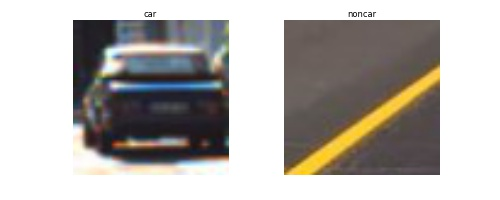
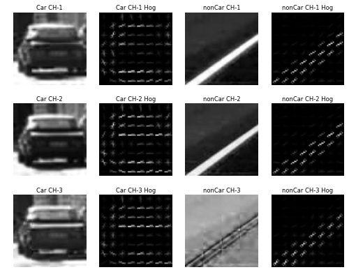
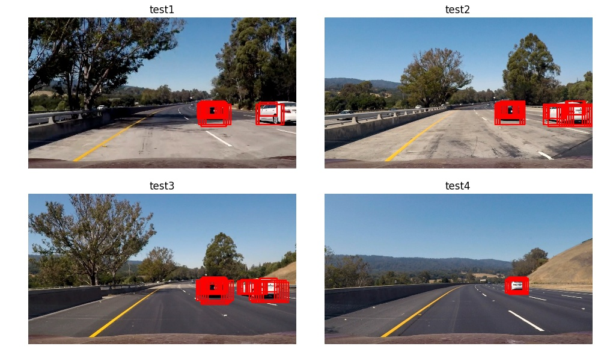
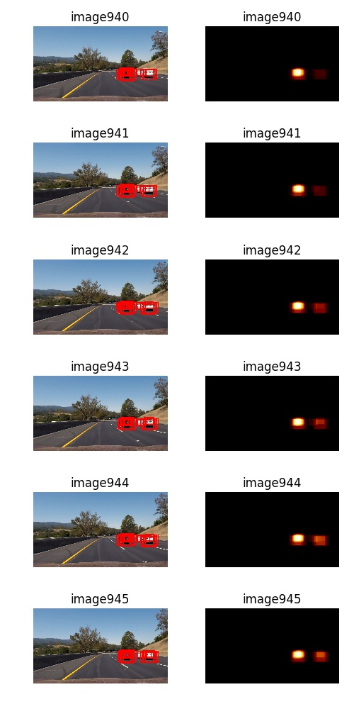
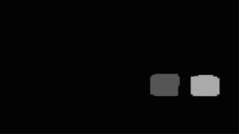
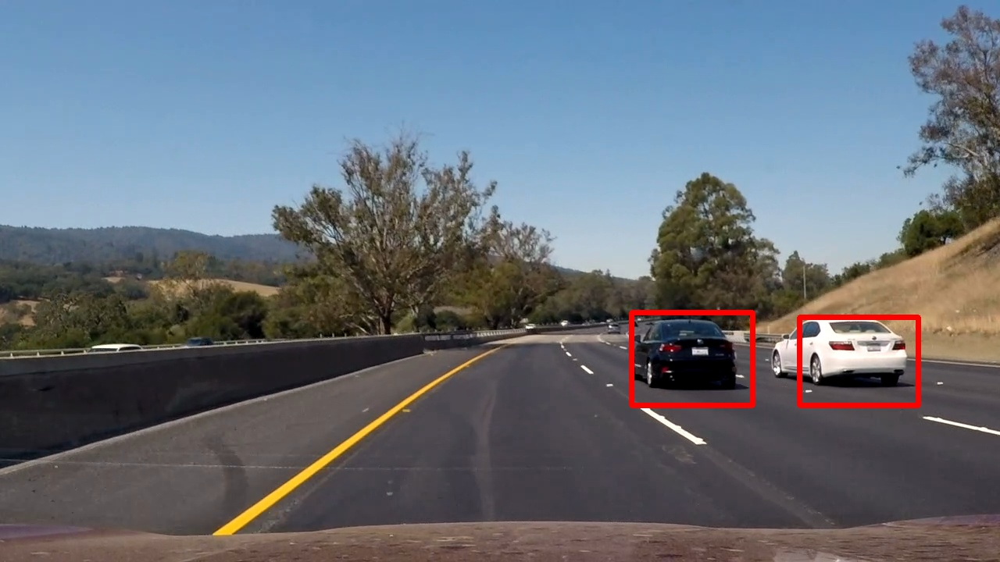

## Vehicle Detection
The goals / steps of this project are the following:
- Extract features using a labeled training set of RGB Images
    - Histograms of Oriented Gradients of each YCrCb color spaces
    - Histograms of value of each YCrCb color spaces
    - Binned raw images of each YCrCb color spaces
* Training a Linear SVM classifier using a extracted features
* Using a sliding-window technique for searching and classifying vehicles.
* Estimate a bounding box for vehicles detected.

[//]: # (Image References)
[image1]: ./example_images/car_noncar.jpg
[image2]: ./example_images/features.jpg
[image3]: ./examples/sliding_windows.jpg
[image4]: ./examples/sliding_window.jpg
[image5]: ./examples/bboxes_and_heat.png
[image6]: ./examples/labels_map.png
[image7]: ./examples/output_bboxes.png
[video1]: ./project_video.mp4

---
### Histogram of Oriented Gradients (HOG)

#### 1. How to extract HOG features from the training images.
The code for this step is contained in lines 17 through 42 of the file called `util.py`.  

I started by reading in all the `vehicle` and `non-vehicle` images. When I see all image directories, there are few images from `left` and `right` view. So I augmented left and right images by using techniques such as flip and brightness conversion. The code for using datasets is contained in lines 65 through 96 of the file called `train.py`.    
Here is an example of one of each of the `vehicle` and `non-vehicle` classes:

<!-- ![alt text][image1] -->

I then explored different color spaces and different `skimage.hog()` parameters (`orientations`, `pixels_per_cell`, and `cells_per_block`).  I grabbed random images from each of the two classes and displayed them to get a feel for what the `skimage.hog()` output looks like.

Here is an example using the `YCrCb` color space and HOG parameters of `orientations=18`, `pixels_per_cell=(8, 8)` and `cells_per_block=(3, 3)`:

<!--![alt text][image2]-->

#### 2. How to settled on final choice of HOG parameters.

First I imitate the parameter of HOG thesis, but the test accuracy is not good. So I increase orientation parameter for extracting more detailed direction of each block gradient, and get more about 2% accuracy.  
And increasing cells_per_block parameter for extracting more robust features to noise.  

#### 3. How to trained a classifier using extracted features

I extracted three features `HOG feature`, `binned image` and `histogram of each channel` of YCrCb color image, and standardize extracted features.  
And then, I trained a linear SVM by using standardized extracted features.   

### Sliding Window Search

#### 1. How to implement a sliding window search.  

I implement a sliding window search by using multiple windows according to the height position of image. As the height is increasing, the size of window is increasing.
And in the image, about the half of it is sky or forests and the lowest part of it is including the own car. So I remove these area for sliding window search. This is the last parameter.  

| y place | Width, Height |　overlap  |
|:----:|:----:|:----:|
| lower | 200, 170 | 0.9 |
| lower-middle | 150, 120 | 0.9 |
| middle | 120, 110 | 0.9 |
| middle | 120, 96 | 0.9 |
| upper | 84, 64 | 0.9 |

#### 2. How to decide parameter of window size and overlap

As the height is increasing, the size of car is bigger. So The window size is decided based on the height of image.  
I examined various window sizes, regions and overlap.  
In the middle area, The size of car is depending on the place. Car in the center looks smaller than the side because we can see not only the back, but also the side of the car.  So in the middle range, I prepared two windows. About the rate of overlap, first I use the smaller parameter when the window size is smaller. But, as the car is smaller, the accuracy of classifier is lower. So I decided all window's overlap is same.   

#### 3. Show examples of classifier

I searched on two scales using YCrCb 3-channel HOG features plus spatially binned color(16×16) and histograms of YCrCb color space, which provided a nice result.  Here are some example images:

---

### Video Implementation

#### 1. Video

#### 2. How to implement some kind of filter for false positives and some method for combining overlapping bounding boxes.

The code for this step is contained in lines 125 through 135 of the file called `test.py`.  
From the detected area from previous 4 frames and the result of sliding window search in a target frame, I created a heatmap and then thresholded that map to identify vehicle positions.  I then used `scipy.ndimage.measurements.label()` to identify individual blobs in the heatmap. I then assumed each blob corresponded to a vehicle. I constructed bounding boxes to cover the area of each blob detected.  

Here's an example result showing the heatmap from a series of frames of video, the result of `scipy.ndimage.measurements.label()` and the bounding boxes then overlaid on the last frame of video:

##### Heatmaps of six frames

##### Output of `scipy.ndimage.measurements.label()` on the integrated heatmap(945 frame in the movie):

##### Resulting bounding boxes are drawn onto the 945 frame in the moview:

---

### Discussion

#### 1. Briefly discuss any problems / issues you faced in your implementation of this project.  Where will your pipeline likely fail?  What could you do to make it more robust?

My pipeline is so slow because of using sliding-window technique. These days, by using convolutional neural network like SSD or YOLO, we can execute both of region proposal and feature sampling simultaneously for object detection.  
If there are steep slopes, my pipeline couldn't recognize cars because I utilize lower part of image(about half).  
And If it's rainy, probably my pipeline couldn't classify cars or not correctly because rain makes the features unclearly.  
